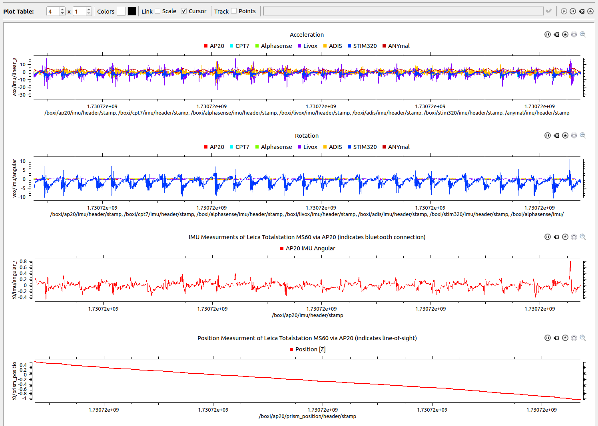

<h1 align="center" style="margin-bottom: 0;">
  <br>
  The GrandTour Dataset
  <br>
</h1>
<p align="center">
  <em><small>A project brought to you by <a href="https://rsl.ethz.ch/">RSL - ETH Zurich</a>.</small></em>
</p>
<p align="center">
  <a href="#references">References</a> •
  <a href="#hugging-face-instructions">Hugging Face</a> •
  <a href="#ros1-instructions">ROS1</a> •
  <a href="#contributing">Contributing</a>  •
  <a href="#citing">Citing</a>
</p>

## References

More instructions can be found on the [official webpage](https://grand-tour.leggedrobotics.com/).
- Recording Setup
- Dataset Explorer
- Benchmarks

## Hugging Face Instructions

You can find Jupyter Notebooks with full instructions in the [`examples_hugging_face`](./examples_hugging_face).  
List of examples:  
- [Accessing GrandTour Data](./examples_hugging_face/[0]_Accessing_GrandTour_Data.ipynb)  
- [Exploring GrandTour Data](./examples_hugging_face/[1]_Exploring_GrandTour_Data.ipynb)

## ROS1 Instructions

### Create Folders
```shell
mkdir -p ~/grand_tour_ws/src
mkdir -p ~/git
```

### Clone and Link Submodules
```shell
# Cloning the repository
cd ~/git
git clone --recurse-submodules git@github.com:leggedrobotics/grand_tour_dataset.git

# Checkout only the required packages from the grand_tour_box repository for simplicity
cd ~/git/grand_tour_dataset/examples_ros1/submodules/grand_tour_box
git sparse-checkout init --cone
git sparse-checkout set box_model box_calibration box_drivers/anymal_msgs box_drivers/gnss_msgs

# Link the repository to the workspace
ln -s ~/git/grand_tour_dataset/examples_ros1 ~/grand_tour_ws/src/
```

### Setup and Build Catkin Workspace
```shell
cd ~/grand_tour_ws
catkin init
catkin config --extend /opt/ros/noetic
catkin config --cmake-args -DCMAKE_BUILD_TYPE=RelWithDebInfo
catkin build grand_tour_ros1
source devel/setup.bash
```

### Download Example Mission
```shell
mkdir -p ~/grand_tour_ws/src/examples_ros1/data
cd ~/grand_tour_ws/src/examples_ros1/data
pip3 install kleinkram
klein login
klein download --mission 3c97a27e-4180-4e40-b8af-59714de54a87
```

### Run the Example

#### Terminal 1: Launch LiDARs
```shell
roslaunch grand_tour_ros1 lidars.launch

# URDFs are automaticlly loaded by:
#    Boxi:     box_model box_model.launch
#    ANYmal:   anymal_d_simple_description load.launch
```

#### Terminal 2: Replay Bags
```shell
cd ~/grand_tour_ws/src/examples_ros1/data
# We provide an easy interface to replay the bags
rosrun grand_tour_ros1 rosbag_play.sh --help
rosrun grand_tour_ros1 rosbag_play.sh --lidars --tf_model

# We provide two tf_bags
#   tf_model contains frames requred for UDRF model of ANYmal and Boxi.
#   tf_minimal contains only core sensor frames.
```

You can also try the same for `cameras.launch`.

#### Image Uncompression and Rectification
We provide a launch file to uncompress images and publish rectified images. Install the required dependencies:
```shell
sudo apt-get install ros-noetic-image-transport
sudo apt-get install ros-noetic-compressed-image-transport
```

```shell
roslaunch grand_tour_ros1 cameras_helpers.launch
```

#### IMUs Visualization
We use rqt-multiplot to visualize the IMU measurments.

Install [rqt_multiplot](https://wiki.ros.org/rqt_multiplot):
```shell
sudo apt-get install ros-noetic-rqt-multiplot -y
```

Start rqt_multiplot and replay the bags:
```shell
roslaunch grand_tour_ros1 imus.launch
```
```shell
cd ~/grand_tour_ws/src/examples_ros1/data
rosrun grand_tour_ros1 rosbag_play.sh --imus --ap20
```

**Example Output:**


## Contributing
We warmly welcome contributions to help us improve and expand this project. Whether you're interested in adding new examples, enhancing existing ones, or simply offering suggestions — we'd love to hear from you! Feel free to open an issue or reach out directly.

We are particularly looking for contributions in the following areas:
- New and interesting benchmarks
- ROS2 integration and conversion
- Visualization tools (e.g., Viser, etc.)
- Hosting and deployment support in Asia

### Upcoming Plans
We're organizing a workshop at ICRA 2026 in Vienna and are currently looking for co-organizers and collaborators. We are also planning to write a community paper about this project. Everyone who contributes meaningfully will be included as a co-author.

Let’s build this together — your input matters!


## Citing

```bibtex
@INPROCEEDINGS{Frey-Tuna-Fu-RSS-25,
    AUTHOR    = {Jonas Frey AND Turcan Tuna AND Lanke Frank Tarimo Fu AND Katharine Patterson AND Tinao Xu AND Maurice Fallon AND Cesar Cadena AND Marco Hutter},
    TITLE     = {{{The GrandTour Dataset: A Legged Robotics Dataset in the Wild}},
    BOOKTITLE = {in preperation for IJRR},
    YEAR      = {2025},
}
```
*shared first authorship: Frey, Tuna, Fu.

```bibtex
@INPROCEEDINGS{Tuna-Frey-IJRR-25,
    AUTHOR    = {Jonas Frey AND Turcan Tuna AND Lanke Frank Tarimo Fu AND Cedric Weibel AND Katharine Patterson AND Benjamin Krummenacher AND Matthias Müller AND Julian Nubert AND Maurice Fallon AND Cesar Cadena AND Marco Hutter},
    TITLE     = {{Boxi: Design Decisions in the Context of Algorithmic Performance for Robotics}},
    BOOKTITLE = {Proceedings of Robotics: Science and Systems},
    YEAR      = {2025},
    ADDRESS   = {Los Angeles, United States},
    MONTH     = {July}
}
```
*shared first authorship: Frey, Tuna.
